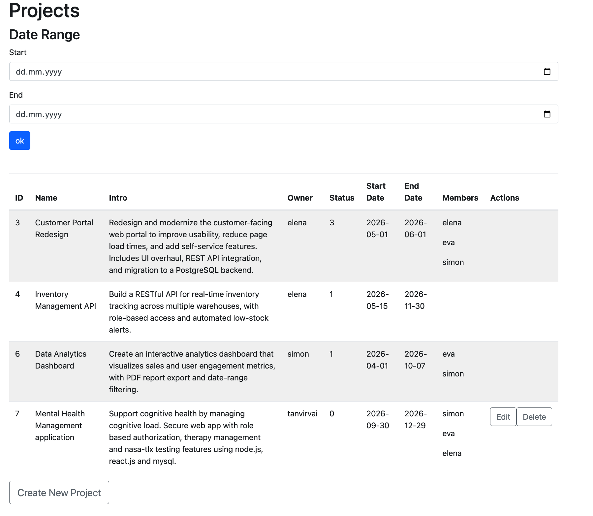
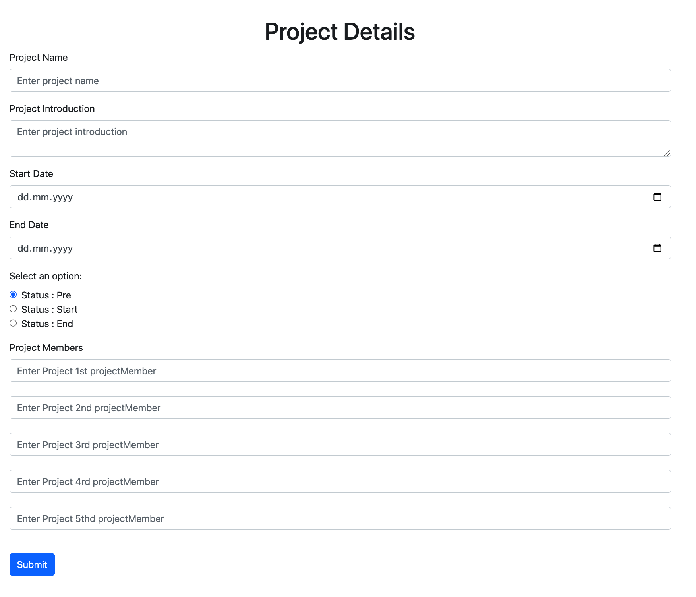
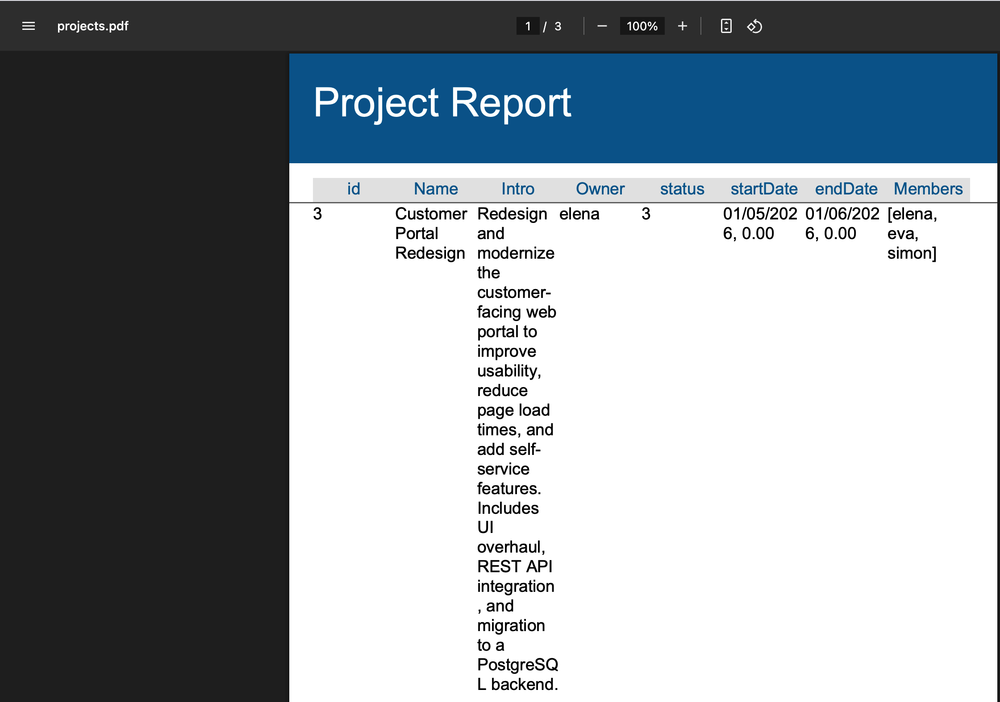
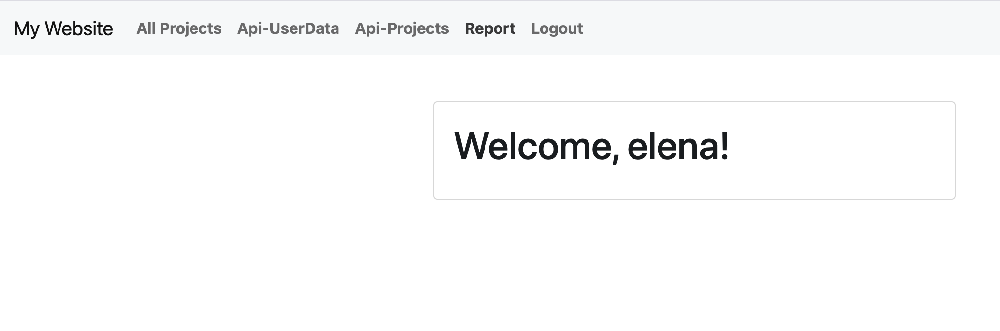

# Project Management System

A full-stack web application for managing projects and team members, built with **Java Spring Boot** and **PostgreSQL**. Users can create, track, and manage projects, assign team members, filter projects by date range, and generate downloadable PDF reports.


## Features

- **User Registration & Authentication** — Sign up for a new account, then log in / log out with session management
- **Project Management** — Full CRUD operations (Create, Read, Update, Delete) for projects
- **Team Members** — Assign multiple users to a project
- **Date Range Filtering** — View projects within a specific start and end date
- **PDF Report Generation** — Generate and download project reports as PDF files (powered by JasperReports)
- **REST API** — Endpoints that serve project and user data as JSON
- **Authentication-protected pages** — Project data is only accessible to logged-in users


## Tech Stack

Backend - Java, Spring Boot 2.7.8 
Database - PostgreSQL 
ORM - Spring Data JPA / Hibernate 
Frontend - Thymeleaf, HTML, CSS 
Reporting - JasperReports 
API - Spring Web (REST controllers, JSON)
Build Tool - Maven 

---

## 📸 Screenshots

### Projects Dashboard
The main dashboard listing all projects with details, members, and date-range filtering.



### Create a New Project
Form to add a new project with name, dates, status, and team members.



### PDF Report
Generated project report, downloadable as a PDF (built with JasperReports).



### Login
Authenticated user landing page.



## Getting Started

### Prerequisites

Make sure you have these installed:

- **Java 17+** (tested with Java 23)
- **PostgreSQL 16**
- **Maven** (or use the included Maven wrapper `./mvnw`)

### Setup

**1. Clone the repository**

```bash
git clone https://github.com/omarbro/project-management-java-springboot-application.git
cd project-management-java-springboot-application/demo
```

**2. Create the PostgreSQL database**

```bash
psql postgres
```

```sql
CREATE DATABASE "projMan";
\q
```

**3. Configure the database connection**

Open `src/main/resources/application.properties` and update the username/password to match your PostgreSQL setup:

```properties
spring.datasource.url=jdbc:postgresql://localhost:5432/projMan
spring.datasource.username=your_username
spring.datasource.password=your_password
```

**4. Run the application**

```bash
./mvnw spring-boot:run
```

**5. Open in your browser**

```
http://localhost:8080
```

---

## Project Structure

```
```
demo/
├── src/main/java/com/example/demo/
│   ├── DemoApplication.java          # Application entry point
│   ├── LoginController.java          # Handles login / logout
│   ├── RegCont.java                  # Handles user registration
│   ├── ProjectController.java        # Web pages for projects & reports
│   ├── ProjectRestController.java    # REST API for projects (JSON)
│   ├── ProjectService.java           # Business logic for projects
│   ├── ProjectRepository.java        # Database access for projects
│   ├── UserApiController.java        # REST API for users (JSON)
│   ├── UserService.java              # Business logic for users
│   ├── UserRepository.java           # Database access for users
│   ├── ReportService.java            # PDF report generation
│   ├── Project.java                  # Project data model
│   ├── Report.java                   # Report data model
│   └── User.java                     # User data model
├── src/main/resources/
│   ├── templates/                    # Thymeleaf HTML pages
│   └── application.properties        # App & database configuration
└── pom.xml                           # Maven dependencies
```
```

---

## 👤 Author

**Omar Been Hasib**
MSc in Software Engineering, University of Oulu, Finland

- Email: adonomar02@gmail.com
- GitHub: [@omarbro](https://github.com/omarbro)
